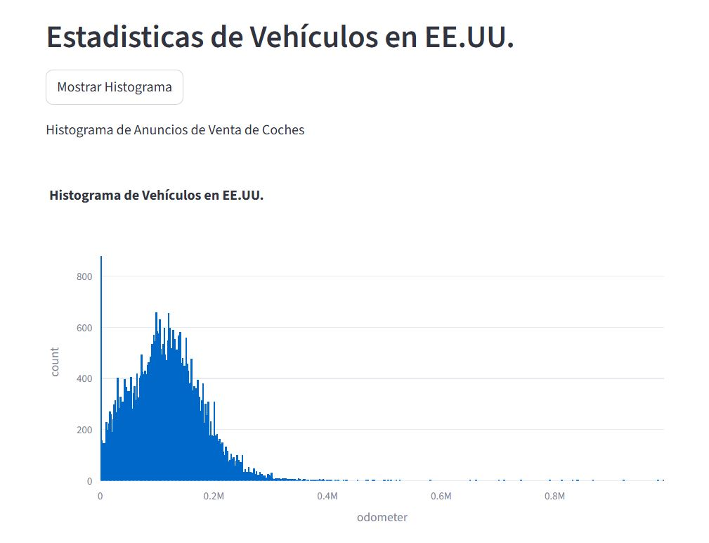
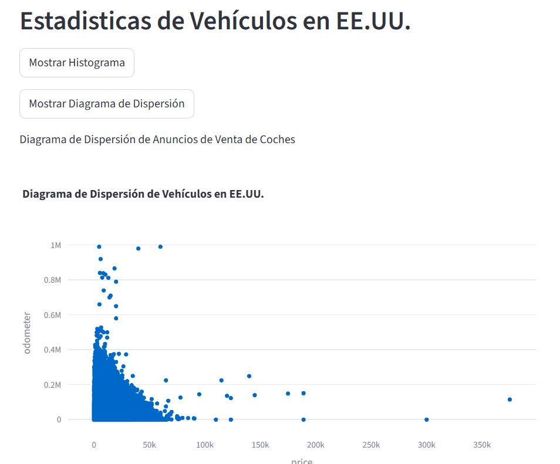

# AutoStats-USA
Una aplicación web para analizar los anuncios de automóviles en USA, generando estadísticos y visualizaciones interactivas.

## Descripción

Esta aplicación utiliza Python con pandas, plotly_express y streamlit para generar dos tipos de diagramas:

- Histograma de los Anuncios de Automóviles en USA
- Diagrama de Dispersión de los Anuncios de Automóviles en USA

Con estos diagramas, puedes analizar los anuncios de automóviles en USA y sus características, como el modelo, precio, tipo de transmisión, etc.

## Demo

Puedes ver la aplicación en acción enlace-al-deploy.

## Tecnologías utilizadas

- Python
- pandas
- plotly_express
- streamlit

## Problema y Solución

El problema que aborda este proyecto es la falta de análisis y visualización de los anuncios de automóviles en USA. La solución es crear una aplicación web que genere estadísticos y visualizaciones interactivas para ayudar a entender mejor los anuncios de automóviles en USA.

## Aprendizajes

Durante el desarrollo de este proyecto, aprendí a:

- Utilizar pandas para manipular y analizar datos
- Crear visualizaciones interactivas con plotly_express
- Desarrollar aplicaciones web con streamlit
1.- Histograma de los Anuncios de Automoviles en USA

2.- Diagrama de Dispersión de los Anuncios de Automoviles en USA

Con dichos diagramas se puede analizar los Anuncios de Automioviles en USA y las caracteristicas de los vehiculos anunciados, asi como el modelo del automovil, su precio, su tipo de transmisión, etc.
